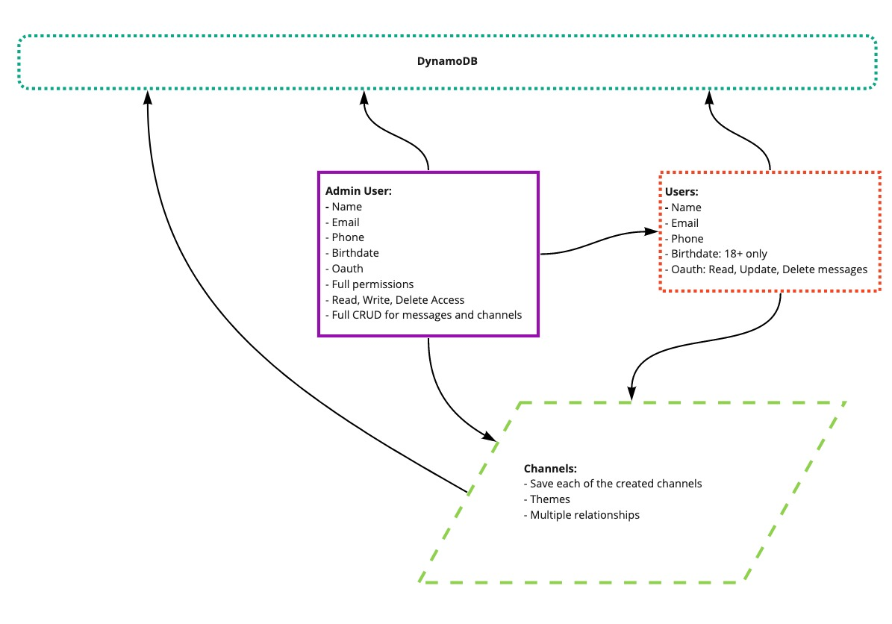
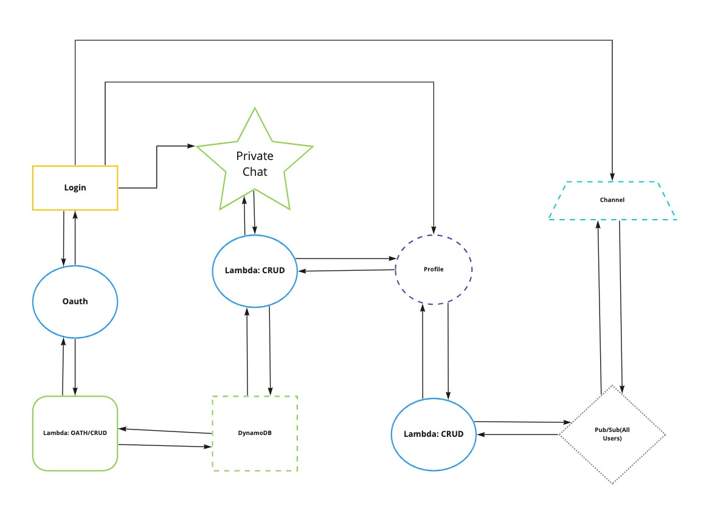

# Vision

What is the vision of this product?

- An app with the ability to connect people to other individuals whether they need services, in need of help, or just want someone to chat with

What pain point does this project solve?

- People feel overwhelmed on their own when faced with challenges of various sorts

Why should we care about your product?

- Because it puts the power in the hands of the users, and is extremely scalable - you can use the same app functionality for people seeking help with something like window cleaning as you can with people seeking mental health counseling from peer users.

# Scope (In/Out)

**IN - What will your product do**

- There needs to be user Authorization

- There needs to be channels users can subscribe to

- There needs to be a form or drop down (minimal front end) so users can select groups

- Users seeking help need to be able to send messages out to subscribed groups

- Users who are subscribed to groups need to be able to see the "in need of help" messages

- Users who are available and willing to help should be able to enter a private message session with the seeker if they choose

- Users should be able to rate their experiences of working with other users

**OUT - What will your product not do**

- App will not auto-pair users, that is in the users hands to do that

- Users cannot create their own channels

- App is not legally liable for user behavior

- App will not be involved in payments between users

# Minimum Viable Product

- Authorization

- Two categories with messaging queue

- The ability to enter a private message with original posters

**Stretch Goals**

- Implement a user rating system (think AirBnb or Ebay, etc)

- More channels

- Icons for professional certifications (licensed therapist, licensed electricians, etc) vs regular people/peers

# Functional Requirements

List the functionality of your product. This will consist of tasks such as the following:

Any user can login

An admin can create a channel

A non admin can view channels and subscribe to them

A user can send an SNS message to a channel

Another user can see and respond to the original messag as a DM

# Data Flow

A user will log in -> Browse available channels -> sign up for channels -> see messages in channel -> send messages to channel -> AND/OR respond to messages in a DM

# Non-Functional Requirements (301 & 401 only)

Non-functional requirements are requirements that are not directly related to the functionality of the application but still important to the app:

- Legal issues

    - What happens if there is an issue with the individuals who meet up? How can the app make it clear we are not responsible?

    - How will be make it clear that this is "peer-based", and the individuals on the site are not necessarily professionals

- Extensibility:

  - User and channel setup are replicatable - easy to copy the functionality of one channel and implement in a new channel. We will use AWS SDK to add new channels with preset properties.

- Modifiability:

  - Code is clean, easy to follow, and well documented.

- Security:

  - We will use OAuth for user authorization

- Testibility:

  - Set up a test that ensures messages are secure and being received

You MUST describe what the non-functional requirement is and how it will be implemented. Simply saying “Our project will be testable for testibility” is NOT acceptable. Tell us how, why, and what.

# Entity Relationship Diagram

# Data Modeling Diagram

